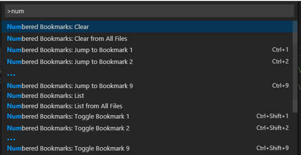
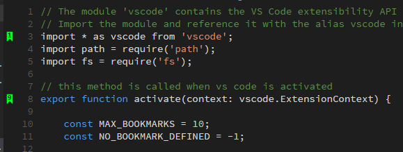
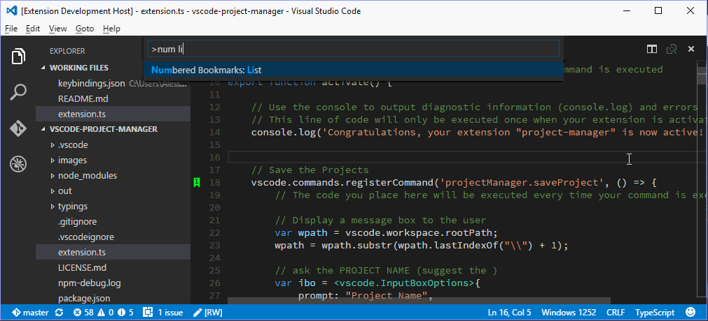
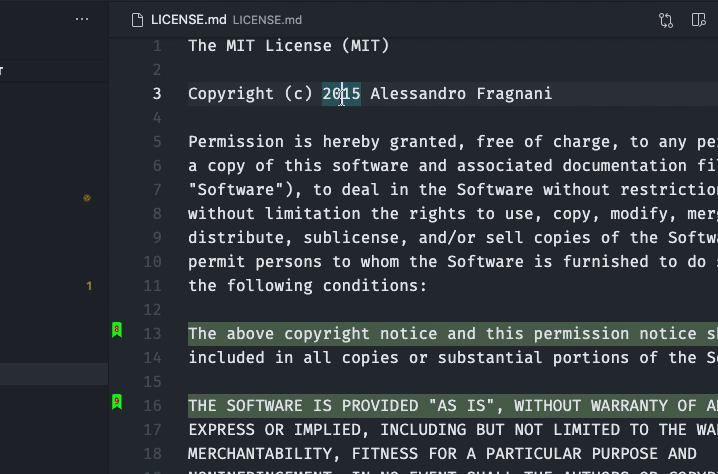

# Functionality

Mark lines in the editor and easily jump to them. _In Delphi style._

# Installation

Press `F1` in VSCode, type `ext install` and then look for `Numbered Bookmarks`.

# Usage

## Available commands

* **Numbered Bookmarks: Toggle Bookmark _'number'_** Mark/unmark the current line with a numbered bookmark
* **Numbered Bookmarks: Jump to Bookmark _'number'_** Move the cursor to the numbered bookmark
* **Numbered Bookmarks: List** List all bookmarks from the current file
* **Numbered Bookmarks: List from All Files** List all bookmarks from the all files
* **Numbered Bookmarks: Clear** remove all bookmarks from the current file
* **Numbered Bookmarks: Clear from All Files** remove all bookmarks from the all files

> Both **Toggle** and **Jump to Bookmark** commands are numbered from 0 to 9

> The Numbered Bookmark **0** has been reactivated in [PR #16](https://github.com/alefragnani/vscode-numbered-bookmarks/pull/16), but because of [this issue](https://github.com/Microsoft/vscode/issues/2585) it has no _keyboard shortcut_ defined. If sometime in the future these OS related limitation disappears, the shortcuts will be restored.



### Numbered Bookmarks: Toggle Bookmark _'number'_

You can easily Mark/Unmark bookmarks on any line. Works even for wrapped lines.



### Numbered Bookmarks: List

List all bookmarks from the current file and easily navigate to any one. It shows you the line contents and temporarily scroll to that line.



### Numbered Bookmarks: List from All Files

List all bookmarks from all files and easily navigate to any one. It shows you the line contents and temporarily scroll to that line.



* Bookmarks from the active file only shows the line number and its contents
* Bookmarks from other files in the project also shows the relative path and filename
* Bookmarks from files outside the project are denoted with 

## Available settings

* Bookmarks are always saved between sessions, and you can decide if it should be saved _in the Project_, so you can add it to your Git/SVN repo and have it in all your machines _(`false` by default)_. Set to `true` and it will save the bookmarks in `.vscode\numbered-bookmarks.json` file.
```
    "numberedBookmarks.saveBookmarksInProject": true
```

> the `saveBookmarksBetweenSessions` setting was replaced by this in version 0.8.0

## Project and Session Based

The bookmarks are saved _per session_ for the project that you are using. You don't have to worry about closing files in _Working Files_. When you reopen the file, the bookmarks are restored.

It also works even if you only _preview_ a file (simple click in TreeView). You can put bookmarks in any file and when you preview it again, the bookmarks will be there.

# Participate

If you have any idea, feel free to create issues and pull requests

# License

[MIT](LICENSE.md) &copy; Alessandro Fragnani

---

[](https://www.paypal.com/cgi-bin/webscr?cmd=_donations&business=EP57F3B6FXKTU&lc=US&item_name=Alessandro%20Fragnani&item_number=vscode%20extensions&currency_code=USD&bn=PP%2dDonationsBF%3abtn_donate_SM%2egif%3aNonHosted) a :coffee: if you enjoy using this extension :wink: