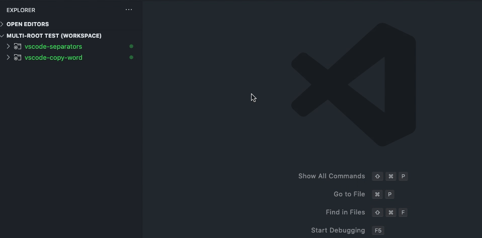

[](https://marketplace.visualstudio.com/items?itemName=alefragnani.numbered-bookmarks)
[](https://marketplace.visualstudio.com/items?itemName=alefragnani.numbered-bookmarks)
[](https://marketplace.visualstudio.com/items?itemName=alefragnani.numbered-bookmarks)

<p align="center">
  <br />
  <a title="Learn more about Numbered Bookmarks" href="http://github.com/alefragnani/vscode-numbered-bookmarks"></a>
</p>

# What's new in Numbered Bookmarks 8.2

* New **Sticky Engine**
* Adds **Virtual Workspaces** support
* Adds **Workspace Trust** support
* Adds **Translation** support
* Improved **Multi-root** support
* Full **Remote Development** support
* Adds **Cross-platform** support

# Support

**Numbered Bookmarks** is an extension created for **Visual Studio Code**. If you find it useful, please consider supporting it.

<table align="center" width="60%" border="0">
  <tr>
    <td>
      <a title="Paypal" href="https://www.paypal.com/cgi-bin/webscr?cmd=_donations&business=EP57F3B6FXKTU&lc=US&item_name=Alessandro%20Fragnani&item_number=vscode%20extensions&currency_code=USD&bn=PP%2dDonationsBF%3abtn_donate_SM%2egif%3aNonHosted"></a>
    </td>
    <td>
      <a title="Paypal" href="https://www.paypal.com/cgi-bin/webscr?cmd=_donations&business=EP57F3B6FXKTU&lc=BR&item_name=Alessandro%20Fragnani&item_number=vscode%20extensions&currency_code=BRL&bn=PP%2dDonationsBF%3abtn_donate_SM%2egif%3aNonHosted"></a>
    </td>
    <td>
      <a title="Patreon" href="https://www.patreon.com/alefragnani"></a>
    </td>
  </tr>
</table>

# Numbered Bookmarks

It helps you to navigate in your code, moving between important positions easily and quickly. No more need to _search for code_. All of this in **_in Delphi style_**.

# Features

## Available commands

* `Numbered Bookmarks: Toggle Bookmark '#number'` Mark/unmark the current position with a numbered bookmark
* `Numbered Bookmarks: Jump to Bookmark '#number'` Move the cursor to the numbered bookmark
* `Numbered Bookmarks: List` List all bookmarks from the current file
* `Numbered Bookmarks: List from All Files` List all bookmarks from the all files
* `Numbered Bookmarks: Clear` remove all bookmarks from the current file
* `Numbered Bookmarks: Clear from All Files` remove all bookmarks from the all files

> Both **Toggle Bookmark** and **Jump to Bookmark** commands are numbered from 0 to 9

> The Numbered Bookmark **0** has been reactivated in [PR #16](https://github.com/alefragnani/vscode-numbered-bookmarks/pull/16), but because of [this issue](https://github.com/Microsoft/vscode/issues/2585) it has no _keyboard shortcut_ defined. If sometime in the future these OS related limitation disappears, the shortcuts will be restored.

> MacOS users should be aware that some commands shortcuts should conflict with native shortcuts, and uses `Cmd` instead of `Ctrl` (`Cmd + Shift + 3` and `Cmd + Shift + 4`)

## Manage your bookmarks

### Toggle Bookmark '#number'

You can easily Mark/Unmark bookmarks on any position. 


> The default shortcuts are numbered from 0 to 9: `Toggle Bookmark #` (`Ctrl + Shift + #`)

### Navigation

### Jump to Bookmark '#number'

> The default shortcuts are numbered from 0 to 9: `Jump to Bookmark #` (`Ctrl + #`)

### List

List all bookmarks from the current file and easily navigate to any one. It shows you the line contents and temporarily scroll to that position.

### List from All Files

List all bookmarks from all files and easily navigate to any one. It shows you the line contents and temporarily scroll to that position.


* Bookmarks from the active file shows the line content and the position
* Bookmarks from other files also shows the relative file path

### Improved Multi-root support

When you work with **multi-root** workspaces, the extension can manage the bookmarks individually for each folder. 

Simply define `saveBookmarksInProject` as `true` on your **User Settings** or in the **Workspace Settings**, and when you run the `Numbered Bookmarks: List from All Files` command, you will be able to select from which folder the bookmarks will be shown.



### Remote Development support

The extension now fully supports **Remote Development** scenarios. 

It means that when you connect to a _remote_ location, like a Docker Container, SSH or WSL, the extension will be available, ready to be used. 

> You don't need to install the extension on the remote anymore.

Better yet, if you use `numberedBookmarks.saveBookmarksInProject` setting defined as `true`, the bookmarks saved locally _will be available_ remotely, and you will be able to navigate and update the bookmarks. Just like it was a resource from folder you opened remotely.

## Available Settings

* Bookmarks are always saved between sessions, and you can decide if it should be saved _in the Project_, so you can add it to your Git/SVN repo and have it in all your machines _(`false` by default)_. Set to `true` and it will save the bookmarks in `.vscode\numbered-bookmarks.json` file.
```json
    "numberedBookmarks.saveBookmarksInProject": true
```

* Controls whether to show a warning when a bookmark is not defined _(`false` by default)_
```json
    "numberedBookmarks.showBookmarkNotDefinedWarning": true
```

* Per [User Requests](https://github.com/alefragnani/vscode-numbered-bookmarks/issues/6) it is now possible to choose how Bookmarks _Navigate Through All Files_:

```json
    "numberedBookmarks.navigateThroughAllFiles"
```

Possible Values:

Value | Explanation
--------- | ---------
`false` | _default_ - same behavior as today
`replace` | you can't have the same numbered bookmark in different files
`allowDuplicates` | you can have the same numbered bookmark in different files, and if you jump repeatedly to the same number, it will look on other files

* **Experimental**. Enables the new **Sticky engine** with support for Formatters, improved source change detections and undo operations _(`true` by default)_

```json
    "numberedBookmarks.experimental.enableNewStickyEngine": false
```

* Choose the gutter icon fill color

```json
    "numberedBookmarks.gutterIconFillColor"
```

* Choose the gutter icon number color

```json
    "numberedBookmarks.gutterIconNumberColor"
```

## Available Colors

* Choose the background color to use on a bookmarked line
```json
    "workbench.colorCustomizations": {
      "numberedBookmarks.lineBackground": "#157EFB22"  
    }
```

* Choose the border color to use on a bookmarked line
```json
    "workbench.colorCustomizations": {
      "numberedBookmarks.lineBorder": "#FF0000"  
    }
```

* Choose marker color to use in the overview ruler
```json
    "workbench.colorCustomizations": {
      "numberedBookmarks.overviewRuler": "#157EFB88"  
    }
```


> For any of the _Color_ settings, you can use color names `blue`, RGB `rgb(0, 255, 37)`, RGBA `rgba(0, 255, 37, 0.2)` or HEX `#00ff25` format.

## Project and Session Based

The bookmarks are saved _per session_ for the project that you are using. You don't have to worry about closing files in _Working Files_. When you reopen the file, the bookmarks are restored.

It also works even if you only _preview_ a file (simple click in TreeView). You can put bookmarks in any file and when you preview it again, the bookmarks will be there.

# License

[MIT](LICENSE.md) &copy; Alessandro Fragnani