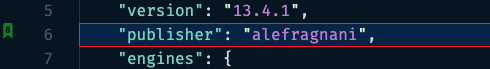

## Customizing Appearance

You can customize not only how the icon is show in the Gutter, but also add a background color to the bookmarked line and the overview ruller.

Something like this in your settings:

```json
    "numberedBookmarks.gutterIconFillColor": "#00FF0077",
    // "numberedBookmarks.gutterIconNumberColor": "157EFB",
    "workbench.colorCustomizations": {
      ...
      "numberedBookmarks.lineBackground": "#0077ff2a",
      "numberedBookmarks.lineBorder": "#FF0000", 
      "numberedBookmarks.overviewRuler": "#157EFB88"  
    }
```

Could end up with a numbered bookmark like this:

