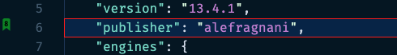

## Görünüşün fərdiləşdirilməsi

Siz kənar zolaq ikonasının görünüşünü fərdiləşdirməklə yanaşı, bookmark olan sətrə və ümumi baxış xətkeşinə fon rəngi də əlavə edə bilərsiniz.

Parametrlərinizdə belə bir nümunə:

```json
    "numberedBookmarks.gutterIconFillColor": "#00FF0077",
    // "numberedBookmarks.gutterIconNumberColor": "157EFB",
    "workbench.colorCustomizations": {
      ...
      "numberedBookmarks.lineBackground": "#0077ff2a",
      "numberedBookmarks.lineBorder": "#FF0000", 
      "numberedBookmarks.overviewRuler": "#157EFB88"  
    }
```

Nömrələnmiş bookmark-ın belə görünməsini təmin edə bilər:

