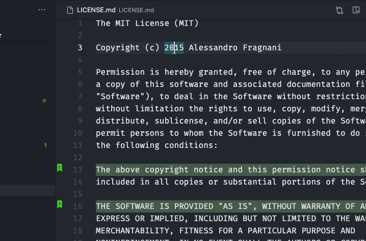

## Numbered Bookmarks-a keçid et

Bookmark-lar kodunuzdakı mövqeləri təmsil edir, beləliklə, lazım olduqda həmin mövqelərə asanlıqla və sürətlə qayıda bilərsiniz. 

Genişlənmə hər bookmark-a sürətlə keçid etmək üçün `Numbered Bookmarks: Bookmark 0-a keçid et` əmrindən `Numbered Bookmarks: Bookmark 9-a keçid et` əmrinə qədər əmrlər təqdim edir və hər birinin öz klaviatura qısayolu var (<kbd>Ctrl</kbd> +  <kbd>#number</kbd>)

Lakin imkanlar bununla məhdudlaşmır. Genişlənmə həmçinin bir fayldakı və ya bütün iş sahəsindəki bütün Numbered Bookmarks-ı görmək və onlara asanlıqla keçid etmək üçün əmrlər təqdim edir. Bunun üçün `Numbered Bookmarks: Siyahı` və `Numbered Bookmarks: Bütün fayllardakı siyahı` əmrlərindən istifadə edin; genişlənmə bookmark olan sətrin önbaxışını və mövqeyini göstərəcək. 

> İpucu: Siyahıda hərəkət etdikdə redaktor müvəqqəti olaraq müvafiq mövqeyə sürüşəcək və həmin bookmark-ın axtardığınız bookmark olub-olmadığını daha yaxşı anlamağınıza kömək edəcək.

